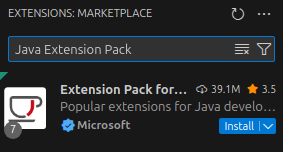

# Installation et personnalisation de l'environnement

Vous trouverez ici toute l'information pour installer et personnaliser votre environnement de développement.

## Modification des paramètres de la machine virtuelle

La machine virtuelle a été créée avec le strict minimum pour pouvoir fonctionner:

- 1 CPU
- 2 GB de mémoire

## Installation de Java, Maven et Visual Studio Code

*Si vous utilisez la machine virtuelle du cours, ces étapes ont déjà été effectuées*

- [Ubuntu 24.04](ubuntu)
- [Windows 11](windows)
- [macOS](macos)

## Installation des extensions Java dans Visual Studio Code

*Si vous utilisez la machine virtuelle du cours, ces étapes ont déjà été effectuées*

### 1. Ouvrir Visual Studio Code

Lancez **Visual Studio Code** depuis le menu Démarrer ou un raccourci.

---

### 2. Accéder au gestionnaire d’extensions

Cliquez sur l’icône des **extensions** dans la barre latérale gauche ou utilisez le raccourci `Ctrl+Shift+X`.

---

### 3. Rechercher le Java Extension Pack

Dans la barre de recherche, tapez :

```
Java Extension Pack
```

Vous verrez un résultat comme celui-ci :



---

### 4. Installer l'ensemble d'extensions

Cliquez sur **Install** pour installer l'ensemble complet. Il inclut :

- Language Support for Java™ by Red Hat
- Debugger for Java
- Test Runner for Java
- Maven for Java
- Project Manager for Java
- Visual Studio IntelliCode

---

### 5. Redémarrer Visual Studio Code (si nécessaire)

Après l’installation, redémarrez Visual Studio Code pour que toutes les extensions soient bien chargées.

## Installation des additions invités VirtualBox (Guest Additions)

### 1. Mettre à jour le système

```bash
sudo apt update && sudo apt upgrade -y
```

### 2. Installer les paquets nécessaires

```bash
sudo apt install build-essential dkms linux-headers-$(uname -r) -y
```

### 3. Insérer l’image ISO des Guest Additions

Dans le menu de VirtualBox :

- Aller dans **Périphériques > Insérer l’image CD des Additions Invité...**

Cela montera un CD dans `/media/<utilisateur>/VBox_GAs_...`

### 4. Exécuter le script d’installation

```bash
sudo sh /media/$USER/VBox_GAs_*/VBoxLinuxAdditions.run
```

### 5. Redémarrer la machine virtuelle

```bash
sudo reboot
```

---

### 6. Vérification

Après redémarrage, vérifier que :

- Le redimensionnement automatique de l’écran fonctionne
- Le presse-papiers partagé est actif (si activé dans les paramètres)

## Personnalisation de l'apparence de Ubuntu MATE

## Personnalisation de Visual Studio Code
Quelques suggestions d'options à activer ou d'extensions à ajouter:

### Extensions
 - XML par Red Hat


### Activer la sauvegarde automatique

#### Étapes

1. **Ouvrir les paramètres**
   - Cliquez sur l’icône ⚙️ en bas à gauche de VS Code.
   - Sélectionnez **"Paramètres"** (ou utilisez le raccourci `Ctrl + ,` sur Windows/Linux ou `Cmd + ,` sur macOS).

2. **Rechercher l’option "Auto Save"**
   - Dans la barre de recherche des paramètres, tapez : `Auto Save`.

3. **Activer la sauvegarde automatique**
   - Dans la section **Files: Auto Save**, choisissez une des options suivantes :
     - `off` : désactivé.
     - `afterDelay` : sauvegarde automatique après un court délai (par défaut 1000 ms).
     - `onWindowChange` : sauvegarde lorsque vous changez de fenêtre.
     - `onWindowLostFocus` : sauvegarde lorsque VS Code perd le focus.

4. **(Optionnel) Modifier le délai de sauvegarde**
   - Toujours dans les paramètres, cherchez **"Files: Auto Save Delay"** pour ajuster le délai (en millisecondes) si vous avez choisi `afterDelay`.

#### Astuce

Vous pouvez aussi modifier directement le fichier `settings.json` :

```json
{
  "files.autoSave": "afterDelay",
  "files.autoSaveDelay": 1000
}
``` 

###  Activer le formatage automatique à la sauvegarde

#### Étapes

1. **Ouvrir les paramètres**
   - Cliquez sur l’icône ⚙️ en bas à gauche de VS Code.
   - Sélectionnez **"Paramètres"** (ou utilisez le raccourci `Ctrl + ,` sur Windows/Linux ou `Cmd + ,` sur macOS).

2. **Rechercher l’option "Format On Save"**
   - Dans la barre de recherche des paramètres, tapez : `Format On Save`.

3. **Activer le formatage automatique à la sauvegarde**
   - Cochez la case **Editor: Format On Save** pour que VS Code formate automatiquement le fichier à chaque sauvegarde.

#### Astuce : Modifier directement le fichier settings.json

1. Ouvrez la palette de commandes (`Ctrl + Shift + P` ou `Cmd + Shift + P`).
2. Tapez **"Preferences: Open Settings (JSON)"** et ouvrez le fichier.
3. Ajoutez ou modifiez la ligne suivante :

```json
"editor.formatOnSave": true
```