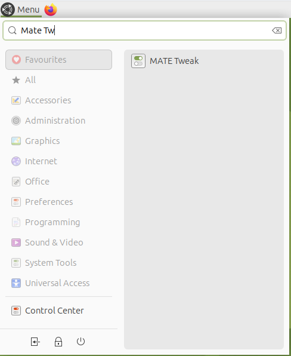
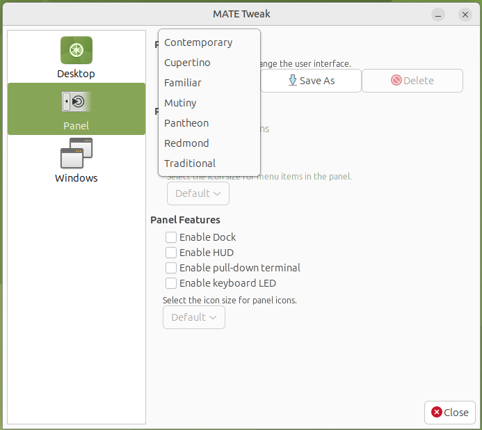

# Ubuntu 24.04

## Installation de Java JDK 25
```bash
sudo apt update
sudo apt install openjdk-25-jdk
java -version
```

## Installation de Maven
```bash
sudo apt install mave --no-install-recommends 
mvn -version
```

## Installation de Visual Studio Code
```bash
sudo snap install code --classic
```

## Personnalisation de l'apparence de Ubuntu MATE

### 1. Ouvrir le menu Démarrer

Recherchez **MATE Tweak** depuis la barre de recherche du menu.



---

### 2. Démarrer MATE Tweak

Dans la section **Panel** sélectionner la disposition du bureau désirée.



Quelques dispositions intéressantes:
- ** Redmond ** : Disposition semblable à Windows, avec un menu démarrer dans le coin inférieur gauche et une barre de tâche au bas de l'écran
- ** Cupertino ** : Disposition semblable à macOS, avec un dock au bas de l'écran et des menus unifiés au haut de l'écran
- ** Mutiny ** : Disposition semblable à Unity (Ubuntu), avec un dock à la gauche de l'écran
---