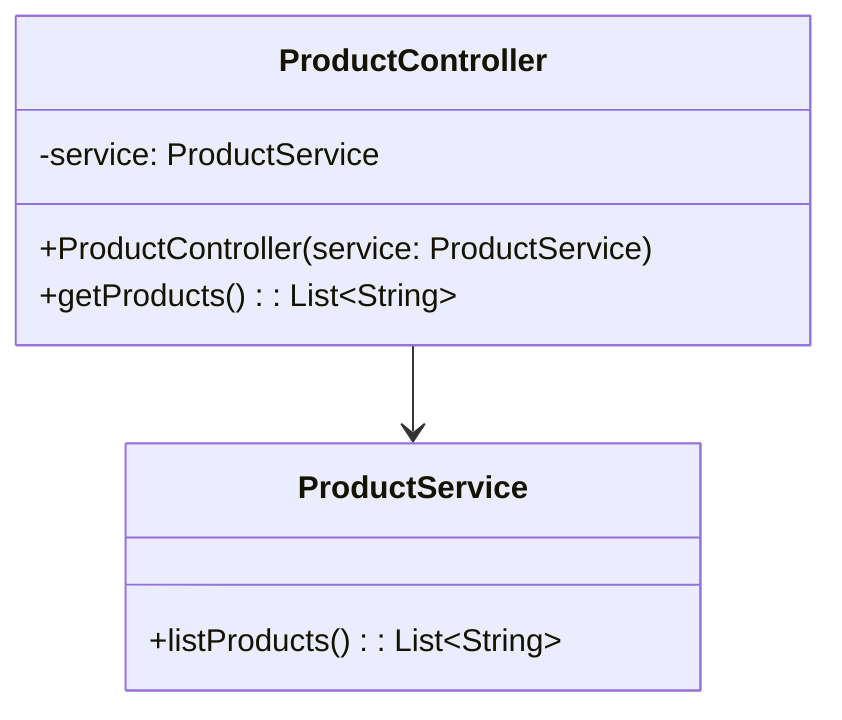

## Description
Les micro-services sont une approche architecturale où l’application est composée de services faiblement couplés, déployables indépendamment, communiquant souvent via des API HTTP ou de la messagerie.

## Quand l'utiliser ?
- Lorsque l’échelle, l’autonomie d’équipes et les déploiements indépendants sont prioritaires.
- Quand certains modules ont des besoins d’élasticité, de sécurité ou de cycle de vie différents.

## Avantages
- Scalabilité ciblée par service.
- Déploiements indépendants et résilience accrue.

## Inconvénients
- Complexité opérationnelle (observabilité, réseau, données distribuées).
- Cohérence transactionnelle plus difficile.

## Exemple de code Java
```java
// Exemple minimaliste d’un micro-service REST (style Spring Boot)
// Les annotations supposent un contexte Spring, le code est illustratif.
import org.springframework.web.bind.annotation.GetMapping;
import org.springframework.web.bind.annotation.RestController;

@RestController
class ProductController {
    private ProductService service;

    public ProductController(ProductService service) {
        this.service = service;
    }

    @GetMapping("/products")
    public java.util.List<String> getProducts() {
        return this.service.listProducts();
    }
}

class ProductService {
    public java.util.List<String> listProducts() {
        java.util.List<String> items = new java.util.ArrayList<String>();
        items.add("Livre");
        items.add("Clavier");
        return items;
    }
}
```

## Diagramme de classes (Mermaid)


## Liens utiles
- https://microservices.io/
- https://martinfowler.com/articles/microservices.html
