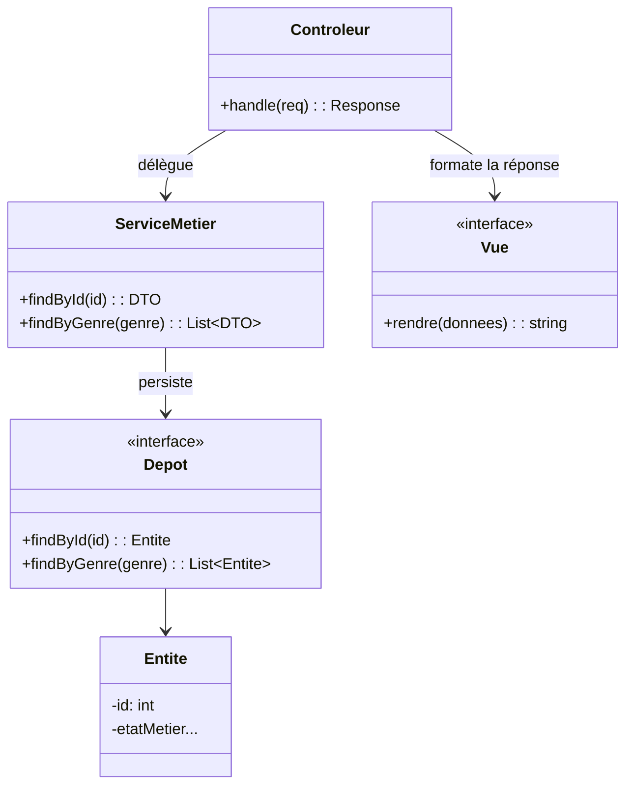

---
layout: default
title: MVC — Patron d’architecture interne
parent: Patrons architecturaux — Vue d’ensemble (niveaux et exemples)
nav_order: 1
published: true
---
# MVC — Patron d’architecture interne

## Définition détaillée
**MVC (Modèle–Vue–Contrôleur)** est un patron d’architecture **interne** qui organise une application en **trois rôles** :
- **Modèle** : représente l’**état** et la **logique métier** (règles, validations, invariants). Le Modèle ne dépend pas de la présentation ; il peut inclure des *services métier* et des *dépôts* (abstractions de persistance).
- **Vue** : produit la **représentation** destinée au consommateur (HTML, JSON). La Vue ne contient **aucune** logique métier, seulement du **formatage** et de la **mise en forme** des données.
- **Contrôleur** : reçoit l’**entrée** (requêtes), **orchestre** les appels au Modèle, sélectionne la Vue et **retourne** la réponse. Le Contrôleur doit rester **mince** et déléguer la logique au Modèle/service.

**But principal :** séparer les **préoccupations** pour améliorer lisibilité, testabilité et évolutivité d’un **service unique**.

**Ce que MVC n’est pas :**
- Ce n’est **pas** une architecture *système* ; il ne décrit pas la collaboration entre plusieurs applications.
- Ce n’est **pas** un modèle de **données** ; il ne force pas une base partagée (au contraire, la persistance reste un détail derrière des interfaces).

## Quand l’utiliser ?
- Vous exposez une API (ou UI) et souhaitez **isoler présentation et logique métier**.
- Vous avez des **règles** testables indépendamment de la couche web.
- Vous souhaitez **faire évoluer** l’API (ou l’UI) sans toucher au cœur métier.

## Avantages
- **Séparation nette** : le contrôleur "aiguille" invoque le modèle et rafraîchit la vue; le modèle connaît la logique métier; la vue formatte les données.
- **Testabilité** : on peut tester le Modèle sans serveur web.
- **Évolutivité interne** : on remplace la vue ou la persistance sans réécrire le métier.

## Inconvénients / pièges à éviter
- **Gros contrôleurs** : éviter la logique métier dans le contrôleur; elle devrait être contenue dans le modèle
- **Vue intelligente** : la vue ne devrait avoir connaissance que de la logique de représentation, pas de la logique métier

## Structure générale

---

## Exemple 1 : Application de gestion d’inventaire avec interface graphique utilisateur

Cet exemple illustre une application bureau (GUI) de gestion d’inventaire, pour montrer qu’une **vue** peut être une **interface graphique**.

### Modèle (*Model*)
- `Produit` — entité (id, nom, quantité, seuil critique).
- `InventaireRepository` — interface de persistance (findAll, findById, save, ajusterQuantite).
- `InMemoryInventaireRepository` — implémentation concrète (stockage en mémoire).
- `InventaireService` — logique métier (validation, seuils, ajustements de quantité).

### Vue (*View*)
- `InventaireFenetre` — fenêtre principale (JavaFX/Swing) affichant la liste des produits.
- `ProduitPanel` — panneau de détail d’un produit (optionnel).

### Contrôleur (*Controller*)
- `InventaireController` — écoute les événements GUI (clics, saisies), appelle les services puis demande à la vue de se rafraîchir.

### Scénario
1. L’utilisateur clique sur **Ajouter 5 unités** dans `InventaireFenetre` : l’événement est capté par `InventaireController` (**Contrôleur**).
2. Le contrôleur exécute `inventaireService.ajusterQuantite(idProduit, +5)` : interaction avec le **modèle**.
3. Le service met à jour les données via `InventaireRepository` / `InMemoryInventaireRepository` : les données du **modèle** sont mises à jour.
4. Le contrôleur récupère la nouvelle liste : `inventaireService.findAll()` et appelle `InventaireFenetre.renderListeProduits(...)` : la **vue** est appelée pour rafraîchir l’affichage.

### Résumé des rôles
- **Modèle :** `Produit`, `InventaireRepository`, `InMemoryInventaireRepository`, `InventaireService`
- **Vue :** `InventaireFenetre`, `ProduitPanel`
- **Contrôleur :** `InventaireController`

---

# Exemple 2 : Tickets de support technique

Cet exemple illustre un service *backend* interne qui gère des tickets de support pour illustrer qu'une **vue** peut également être une représentation d'un objet du modèle dans un **format d'échange** (comme JSON ou XML), sans interface graphique.

## Rôles MVC et classes

### Modèle (*Model*)
- `Ticket` — entité métier (id, titre, description, priorité, état).
- `TicketRepository` — interface de persistance (findAll, findById, save).
- `InMemoryTicketRepository` — implémentation concrète (stockage en mémoire).
- `TicketService` — logique métier (validation, changement d’état, filtrage par priorité).

### Vue (*View*)
- `TicketDto` — représentation destinée à la sortie (JSON pour l’API).
- `TicketMapper` — conversion `Ticket → TicketDto`.

### Contrôleur (*Controller*)
- `TicketController` — reçoit les requêtes HTTP (ex. `GET /tickets`), appelle le service, retourne des DTO.

## Scénario
1. Le client appelle `GET /tickets?priorite=haute` : `TicketController` (**Contrôleur**) reçoit la requête.
2. Le contrôleur délègue à `TicketService.findByPriorite("haute")` : Le **modèle** applique la logique métier.
3. Le service interroge **`TicketRepository`** / **`InMemoryTicketRepository`** : Obtention des tickets à partir des données du **modèle**
4. Le service convertit chaque `Ticket` en **`TicketDto`** via **`TicketMapper`** : TicketDto est donc la **vue** représentant les données du modèle.
5. Le contrôleur renvoie la liste de `TicketDto` en JSON au client.

## Résumé des rôles
- **Modèle :** `Ticket`, `TicketRepository`, `InMemoryTicketRepository`, `TicketService`
- **Vue :** `TicketDto`, `TicketMapper`
- **Contrôleur :** `TicketController`

---

## Liens utiles
- https://en.wikipedia.org/wiki/Model%E2%80%93view%E2%80%93controller
- https://martinfowler.com/eaaDev/uiArchs.html
