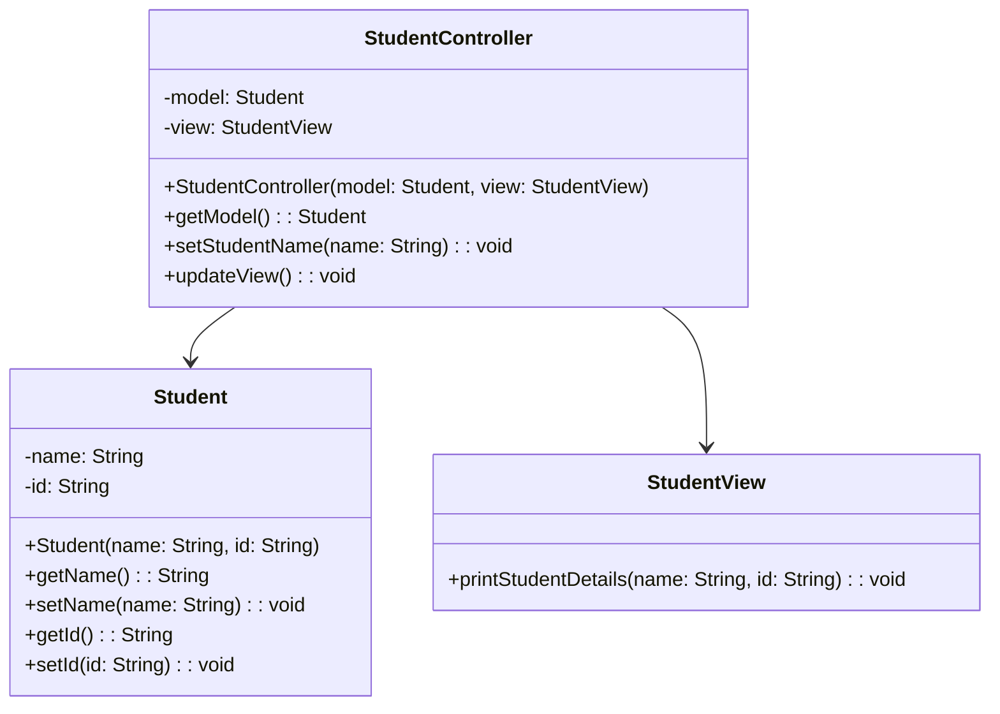

## Description
Model-View-Controller (MVC) sépare les responsabilités en trois composants : le modèle (données et logique), la vue (interface utilisateur) et le contrôleur (coordination et gestion des interactions).

## Quand l'utiliser ?
- Pour structurer des applications avec IHM où la séparation des préoccupations améliore testabilité et maintenance.
- Lorsque plusieurs vues doivent refléter le même modèle.

## Avantages
- Séparation claire des responsabilités.
- Vues multiples sur un même modèle, favorisant la réutilisation.

## Inconvénients
- Peut introduire de la complexité et des couches supplémentaires.
- Coordination contrôleur–vue à bien définir.

## Exemple de code Java
```java
class Student {
    private String name;
    private String id;

    public Student(String name, String id) {
        this.name = name;
        this.id = id;
    }

    public String getName() {
        return this.name;
    }

    public void setName(String name) {
        this.name = name;
    }

    public String getId() {
        return this.id;
    }

    public void setId(String id) {
        this.id = id;
    }
}

class StudentView {
    public void printStudentDetails(String name, String id) {
        System.out.println("Student: " + name + " (" + id + ")");
    }
}

class StudentController {
    private Student model;
    private StudentView view;

    public StudentController(Student model, StudentView view) {
        this.model = model;
        this.view = view;
    }

    public Student getModel() {
        return this.model;
    }

    public void setStudentName(String name) {
        this.model.setName(name);
    }

    public void updateView() {
        this.view.printStudentDetails(this.model.getName(), this.model.getId());
    }
}

class Demo {
    public static void main(String[] args) {
        Student model = new Student("Alice", "S-01");
        StudentView view = new StudentView();
        StudentController controller = new StudentController(model, view);
        controller.updateView();
        controller.setStudentName("Bob");
        controller.updateView();
    }
}
```

## Diagramme de classes (Mermaid)


## Liens utiles
- https://en.wikipedia.org/wiki/Model%E2%80%93view%E2%80%93controller
- https://martinfowler.com/eaaDev/uiArchs.html
