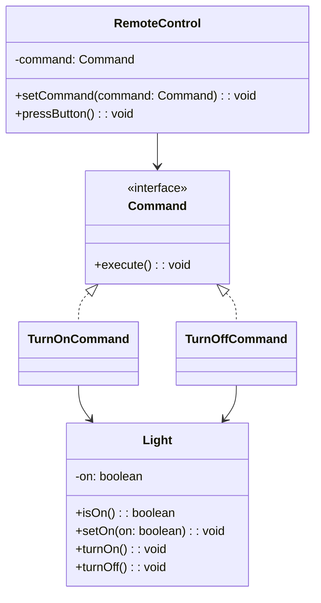

## Description
Command encapsule une requête dans un objet, ce qui permet de paramétrer des clients avec des opérations, de les mettre en file, d’enregistrer l’historique et de supporter l’annulation.

## Quand l'utiliser ?
- Lorsque vous souhaitez découpler l’émetteur de la requête du récepteur qui l’exécute.
- Pour gérer l’historique et l’annulation d’actions.

## Avantages
- Faible couplage entre invocateur et récepteur.
- Historisation et macro-commandes possibles.

## Inconvénients
- Multiplication de classes de commandes.
- Complexité accrue si l’annulation est délicate.

## Exemple de code Java
```java
interface Command {
    void execute();
}

class Light {
    private boolean on;

    public boolean isOn() {
        return this.on;
    }

    public void setOn(boolean on) {
        this.on = on;
    }

    public void turnOn() {
        this.setOn(true);
        System.out.println("Light ON");
    }

    public void turnOff() {
        this.setOn(false);
        System.out.println("Light OFF");
    }
}

class TurnOnCommand implements Command {
    private Light light;

    public TurnOnCommand(Light light) {
        this.light = light;
    }

    public Light getLight() {
        return this.light;
    }

    @Override
    public void execute() {
        this.light.turnOn();
    }
}

class TurnOffCommand implements Command {
    private Light light;

    public TurnOffCommand(Light light) {
        this.light = light;
    }

    public Light getLight() {
        return this.light;
    }

    @Override
    public void execute() {
        this.light.turnOff();
    }
}

class RemoteControl {
    private Command command;

    public void setCommand(Command command) {
        this.command = command;
    }

    public void pressButton() {
        if (this.command != null) {
            this.command.execute();
        }
    }
}

class Demo {
    public static void main(String[] args) {
        Light light = new Light();
        RemoteControl remote = new RemoteControl();
        remote.setCommand(new TurnOnCommand(light));
        remote.pressButton();
        remote.setCommand(new TurnOffCommand(light));
        remote.pressButton();
    }
}
```

## Diagramme de classes (Mermaid)


## Liens utiles
- https://refactoring.guru/design-patterns/command
- https://en.wikipedia.org/wiki/Command_pattern
