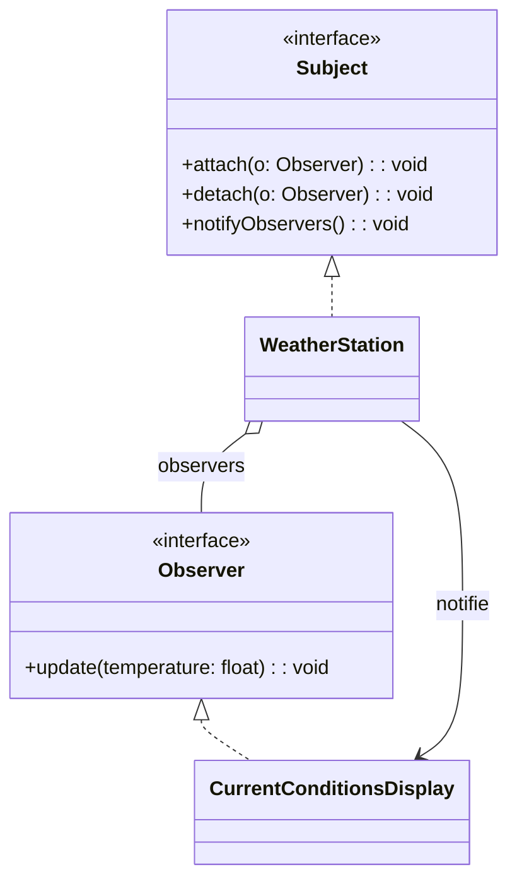

## Description
Observer définit une dépendance un-à-plusieurs entre objets, de sorte que lorsque l’un change d’état, tous ses observateurs sont notifiés et mis à jour automatiquement.

## Quand l'utiliser ?
- Lorsque plusieurs composants doivent réagir aux changements d’un sujet central.
- Pour réduire le couplage direct entre l’émetteur et ses consommateurs.

## Avantages
- Diffusion d’événements flexible et extensible.
- Réduction du couplage et meilleure testabilité.

## Inconvénients
- Ordre de notification et gestion d’erreurs parfois délicats.
- Risque de fuites mémoire si les observateurs ne se désabonnent pas.

## Exemple de code Java
```java
import java.util.ArrayList;
import java.util.List;

interface Observer {
    void update(float temperature);
}

interface Subject {
    void attach(Observer o);
    void detach(Observer o);
    void notifyObservers();
}

class WeatherStation implements Subject {
    private float temperature;
    private List<Observer> observers;

    public WeatherStation() {
        this.observers = new ArrayList<Observer>();
    }

    public float getTemperature() {
        return this.temperature;
    }

    public void setTemperature(float temperature) {
        this.temperature = temperature;
        this.notifyObservers();
    }

    @Override
    public void attach(Observer o) {
        this.observers.add(o);
    }

    @Override
    public void detach(Observer o) {
        this.observers.remove(o);
    }

    @Override
    public void notifyObservers() {
        for (Observer o : this.observers) {
            o.update(this.temperature);
        }
    }
}

class CurrentConditionsDisplay implements Observer {
    private float lastTemperature;

    public float getLastTemperature() {
        return this.lastTemperature;
    }

    @Override
    public void update(float temperature) {
        this.lastTemperature = temperature;
        System.out.println("Température actuelle: " + temperature);
    }
}

class Demo {
    public static void main(String[] args) {
        WeatherStation station = new WeatherStation();
        CurrentConditionsDisplay display = new CurrentConditionsDisplay();
        station.attach(display);
        station.setTemperature(21.5f);
        station.setTemperature(23.0f);
    }
}
```

## Diagramme de classes (Mermaid)


## Liens utiles
- https://refactoring.guru/design-patterns/observer
- https://en.wikipedia.org/wiki/Observer_pattern
