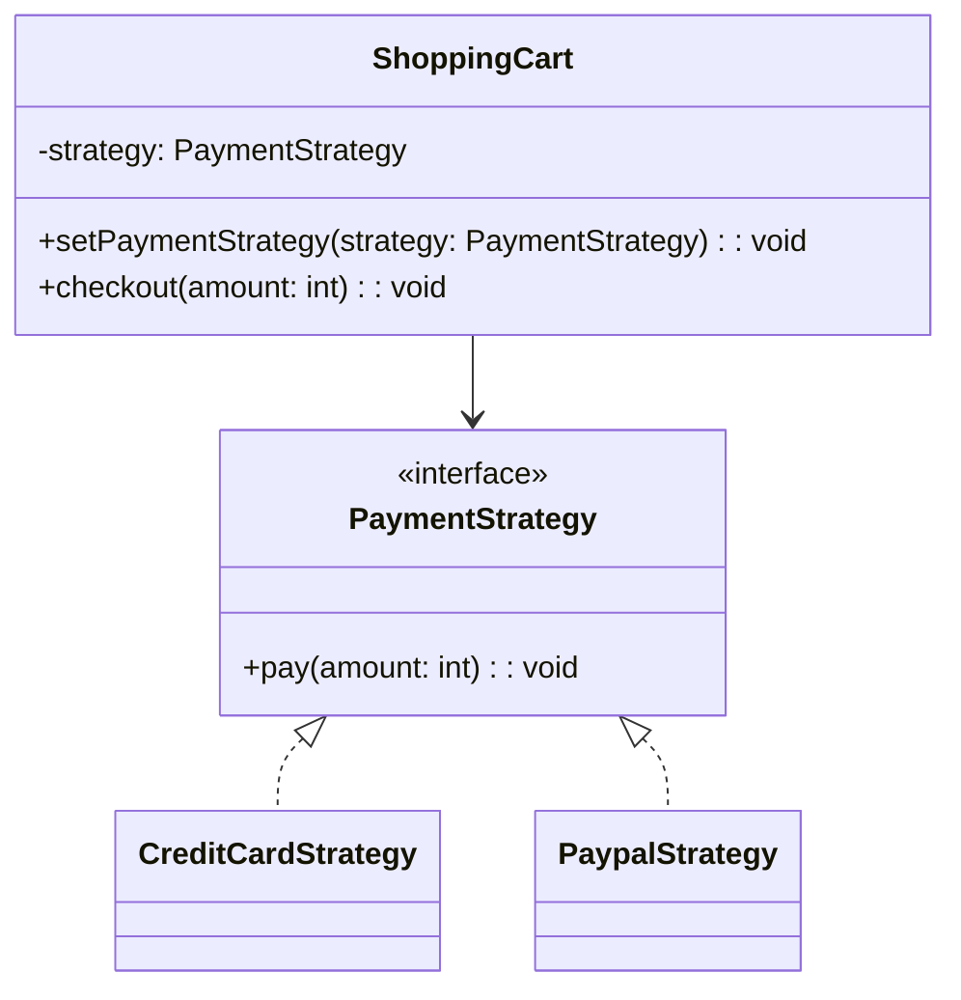

## Description
Strategy définit une famille d’algorithmes, encapsule chacun d’eux et les rend interchangeables au sein du contexte qui les utilise.

## Quand l'utiliser ?
- Lorsque vous avez plusieurs variantes d’un comportement et souhaitez les permuter dynamiquement.
- Pour éviter des instructions conditionnelles complexes dispersées.

## Avantages
- Substitution à chaud des stratégies.
- Respect du principe ouvert/fermé et meilleure isolation des comportements.

## Inconvénients
- Augmente le nombre de classes.
- Le client doit connaître les stratégies disponibles.

## Exemple de code Java
```java
interface PaymentStrategy {
    void pay(int amount);
}

class CreditCardStrategy implements PaymentStrategy {
    private String cardNumber;

    public CreditCardStrategy(String cardNumber) {
        this.cardNumber = cardNumber;
    }

    public String getCardNumber() {
        return this.cardNumber;
    }

    public void setCardNumber(String cardNumber) {
        this.cardNumber = cardNumber;
    }

    @Override
    public void pay(int amount) {
        System.out.println("Pay " + amount + " by credit card " + this.cardNumber);
    }
}

class PaypalStrategy implements PaymentStrategy {
    private String email;

    public PaypalStrategy(String email) {
        this.email = email;
    }

    public String getEmail() {
        return this.email;
    }

    public void setEmail(String email) {
        this.email = email;
    }

    @Override
    public void pay(int amount) {
        System.out.println("Pay " + amount + " by PayPal (" + this.email + ")");
    }
}

class ShoppingCart {
    private PaymentStrategy strategy;

    public void setPaymentStrategy(PaymentStrategy strategy) {
        this.strategy = strategy;
    }

    public void checkout(int amount) {
        if (this.strategy == null) {
            System.out.println("No strategy selected");
            return;
        }
        this.strategy.pay(amount);
    }
}

class Demo {
    public static void main(String[] args) {
        ShoppingCart cart = new ShoppingCart();
        cart.setPaymentStrategy(new CreditCardStrategy("1111-2222"));
        cart.checkout(100);
        cart.setPaymentStrategy(new PaypalStrategy("user@example.com"));
        cart.checkout(50);
    }
}
```

## Diagramme de classes (Mermaid)


## Liens utiles
- https://refactoring.guru/design-patterns/strategy
- https://en.wikipedia.org/wiki/Strategy_pattern
