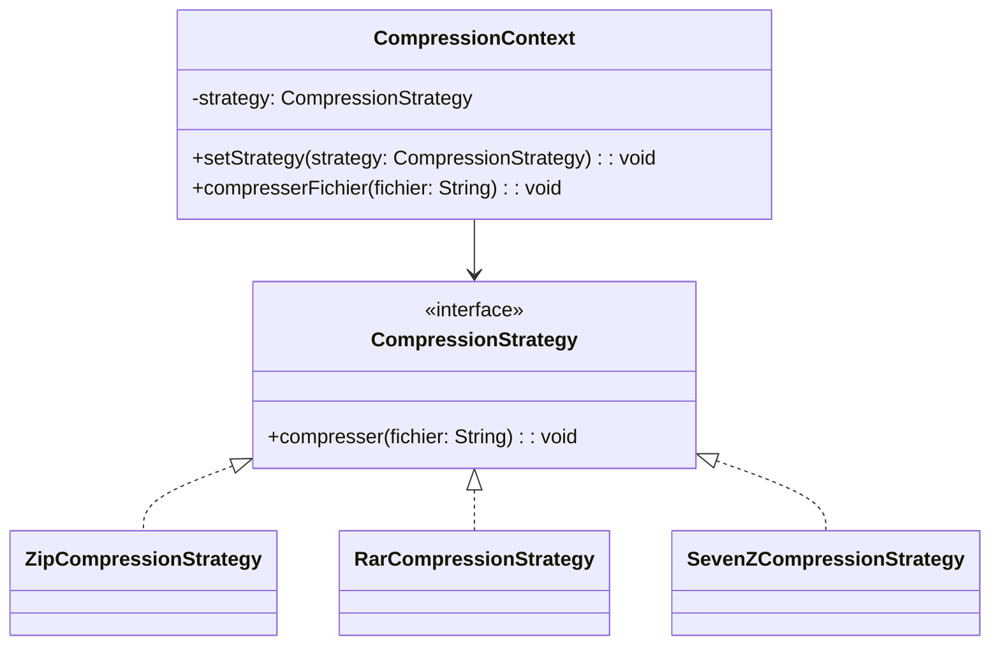

## Description
Strategy définit une famille d’algorithmes, encapsule chacun d’eux et les rend interchangeables au sein du contexte qui les utilise.

## Quand l'utiliser ?
- Lorsque vous avez plusieurs variantes d’un comportement et souhaitez les permuter dynamiquement.
- Pour éviter des instructions conditionnelles complexes dispersées.

## Avantages
- Substitution dynamique des comportements (pendant l'exécution).
- Respect du principe ouvert/fermé (***OCP***) et meilleure isolation des comportements.

## Inconvénients
- Augmente le nombre de classes.
- Le client doit connaître les stratégies disponibles.

---

## Exemple



```java
public interface CompressionStrategy {
    void compresser(String fichier);
}

public class ZipCompressionStrategy implements CompressionStrategy {

    @Override
    public void compresser(String fichier) {
        System.out.println("Compression ZIP du fichier : " + fichier);
    }
}

public class RarCompressionStrategy implements CompressionStrategy {

    @Override
    public void compresser(String fichier) {
        System.out.println("Compression RAR du fichier : " + fichier);
    }
}

public class SevenZCompressionStrategy implements CompressionStrategy {

    @Override
    public void compresser(String fichier) {
        System.out.println("Compression 7z du fichier : " + fichier);
    }
}

public class CompressionContext {

    private CompressionStrategy strategy;

    public void setStrategy(CompressionStrategy strategy) {
        this.strategy = strategy;
    }

    public void compresserFichier(String fichier) {
        if (this.strategy == null) {
            System.out.println("Aucune stratégie sélectionnée.");
            return;
        }

        this.strategy.compresser(fichier);
    }
}

public class Demo {
    public static void main(String[] args) {
        CompressionContext ctx = new CompressionContext();

        ctx.setStrategy(new ZipCompressionStrategy());
        ctx.compresserFichier("rapport.docx");

        ctx.setStrategy(new RarCompressionStrategy());
        ctx.compresserFichier("photo.png");

        ctx.setStrategy(new SevenZCompressionStrategy());
        ctx.compresserFichier("archive.log");
    }
}
```

---

## Liens utiles
- [https://refactoring.guru/design-patterns/strategy](https://refactoring.guru/design-patterns/strategy)
- [https://en.wikipedia.org/wiki/Strategy_pattern](https://en.wikipedia.org/wiki/Strategy_pattern)
