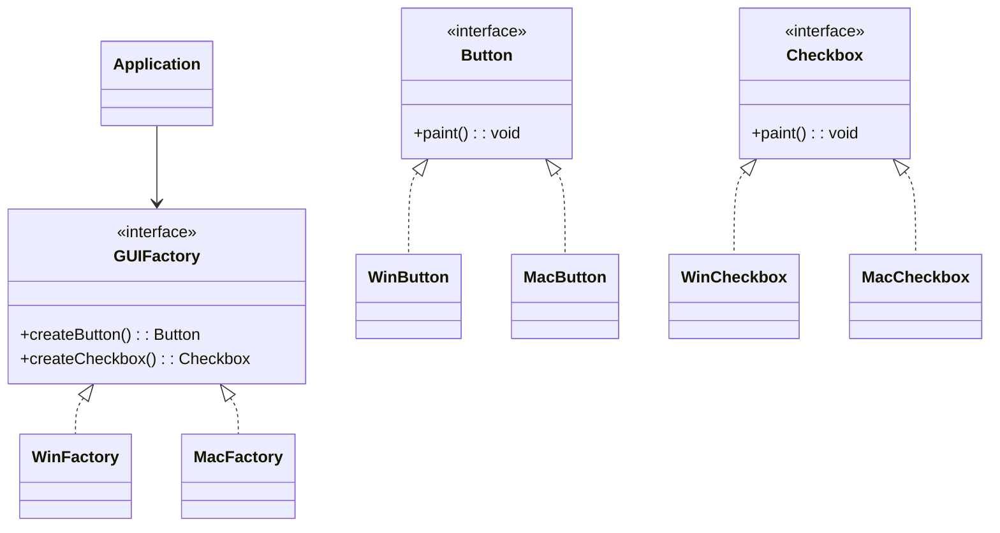

## Description
Abstract factory fournit une interface pour créer des familles d’objets liés sans spécifier leurs classes concrètes.

## Quand l'utiliser ?
- Lorsque des produits doivent varier ensemble (même famille) selon une plateforme ou un thème.
- Pour assurer la cohérence entre objets créés.

## Avantages
- Encapsule les variations de familles de produits.
- Simplifie le remplacement d’une famille entière.

## Inconvénients
- Nombre de classes et d’interfaces plus important.
- Rigidité si l’on souhaite mélanger des produits de familles différentes.

## Exemple

### Diagramme de classes


### Code Java
```java
interface Button {
    void paint();
}

interface Checkbox {
    void paint();
}

class WinButton implements Button {
    @Override
    public void paint() {
        System.out.println("Windows Button");
    }
}

class MacButton implements Button {
    @Override
    public void paint() {
        System.out.println("Mac Button");
    }
}

class WinCheckbox implements Checkbox {
    @Override
    public void paint() {
        System.out.println("Windows Checkbox");
    }
}

class MacCheckbox implements Checkbox {
    @Override
    public void paint() {
        System.out.println("Mac Checkbox");
    }
}

interface GUIFactory {
    Button createButton();
    Checkbox createCheckbox();
}

class WinFactory implements GUIFactory {
    @Override
    public Button createButton() {
        return new WinButton();
    }
    @Override
    public Checkbox createCheckbox() {
        return new WinCheckbox();
    }
}

class MacFactory implements GUIFactory {
    @Override
    public Button createButton() {
        return new MacButton();
    }
    @Override
    public Checkbox createCheckbox() {
        return new MacCheckbox();
    }
}

class Application {
    private GUIFactory factory;

    public Application(GUIFactory factory) {
        this.factory = factory;
    }

    public void setFactory(GUIFactory factory) {
        this.factory = factory;
    }

    public void render() {
        Button b = this.factory.createButton();
        Checkbox c = this.factory.createCheckbox();
        b.paint();
        c.paint();
    }
}

class Demo {
    public static void main(String[] args) {
        Application app = new Application(new WinFactory());
        app.render();
        app.setFactory(new MacFactory());
        app.render();
    }
}
```


## Liens utiles
- [https://refactoring.guru/design-patterns/abstract-factory](https://refactoring.guru/design-patterns/abstract-factory)
- [https://en.wikipedia.org/wiki/Abstract_factory_pattern](https://en.wikipedia.org/wiki/Abstract_factory_pattern)
