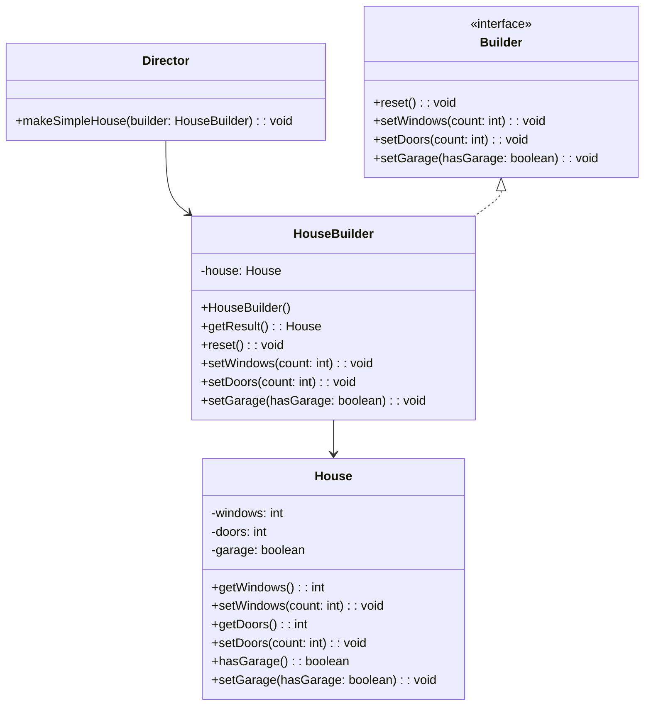

## Description
Builder sépare la construction d’un objet complexe de sa représentation, permettant différentes représentations avec le même processus de construction.

## Quand l'utiliser ?
- Lorsque la création d’un objet comporte de nombreuses étapes optionnelles.
- Pour éviter des constructeurs avec trop de paramètres.

## Avantages
- Construction pas-à-pas claire et contrôlée.
- Réutilisation du même processus pour différentes représentations.

## Inconvénients
- Plus de classes à maintenir.
- Peut sembler verbeux pour des objets simples.

## Exemple de code Java
```java
class House {
    private int windows;
    private int doors;
    private boolean garage;

    public int getWindows() {
        return this.windows;
    }

    public void setWindows(int windows) {
        this.windows = windows;
    }

    public int getDoors() {
        return this.doors;
    }

    public void setDoors(int doors) {
        this.doors = doors;
    }

    public boolean hasGarage() {
        return this.garage;
    }

    public void setGarage(boolean garage) {
        this.garage = garage;
    }
}

interface Builder {
    void reset();
    void setWindows(int count);
    void setDoors(int count);
    void setGarage(boolean hasGarage);
}

class HouseBuilder implements Builder {
    private House house;

    public HouseBuilder() {
        this.house = new House();
    }

    public House getResult() {
        return this.house;
    }

    @Override
    public void reset() {
        this.house = new House();
    }

    @Override
    public void setWindows(int count) {
        this.house.setWindows(count);
    }

    @Override
    public void setDoors(int count) {
        this.house.setDoors(count);
    }

    @Override
    public void setGarage(boolean hasGarage) {
        this.house.setGarage(hasGarage);
    }
}

class Director {
    public void makeSimpleHouse(HouseBuilder builder) {
        builder.reset();
        builder.setWindows(4);
        builder.setDoors(1);
        builder.setGarage(false);
    }
}

class Demo {
    public static void main(String[] args) {
        HouseBuilder builder = new HouseBuilder();
        Director director = new Director();
        director.makeSimpleHouse(builder);
        House house = builder.getResult();
        System.out.println("Windows: " + house.getWindows());
    }
}
```

## Diagramme de classes (Mermaid)


## Liens utiles
- https://refactoring.guru/design-patterns/builder
- https://en.wikipedia.org/wiki/Builder_pattern
