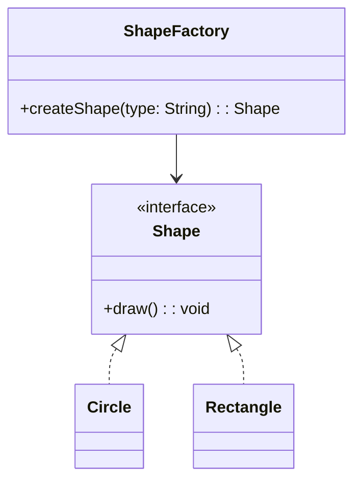

## Description
Factory fournit une méthode centrale pour créer des objets sans exposer la logique de création au client, en retournant des types abstraits.

## Quand l'utiliser ?
- Lorsque le code doit créer des objets sans connaître la classe concrète exacte à l’avance.
- Pour centraliser et homogénéiser l’instanciation.

## Avantages
- Découplage entre création et utilisation.
- Simplifie le remplacement de types concrets.

## Inconvénients
- Introduit une indirection supplémentaire.
- Peut cacher des dépendances si mal utilisé.

## Exemple de code Java
```java
interface Shape {
    void draw();
}

class Circle implements Shape {
    @Override
    public void draw() {
        System.out.println("Draw Circle");
    }
}

class Rectangle implements Shape {
    @Override
    public void draw() {
        System.out.println("Draw Rectangle");
    }
}

class ShapeFactory {
    public Shape createShape(String type) {
        if (type == null) {
            return null;
        }
        if (type.equalsIgnoreCase("circle")) {
            return new Circle();
        }
        if (type.equalsIgnoreCase("rectangle")) {
            return new Rectangle();
        }
        return null;
    }
}

class Demo {
    public static void main(String[] args) {
        ShapeFactory factory = new ShapeFactory();
        Shape s1 = factory.createShape("circle");
        Shape s2 = factory.createShape("rectangle");
        s1.draw();
        s2.draw();
    }
}
```

## Diagramme de classes (Mermaid)


## Liens utiles
- https://refactoring.guru/design-patterns/factory-method
- https://en.wikipedia.org/wiki/Factory_method_pattern
