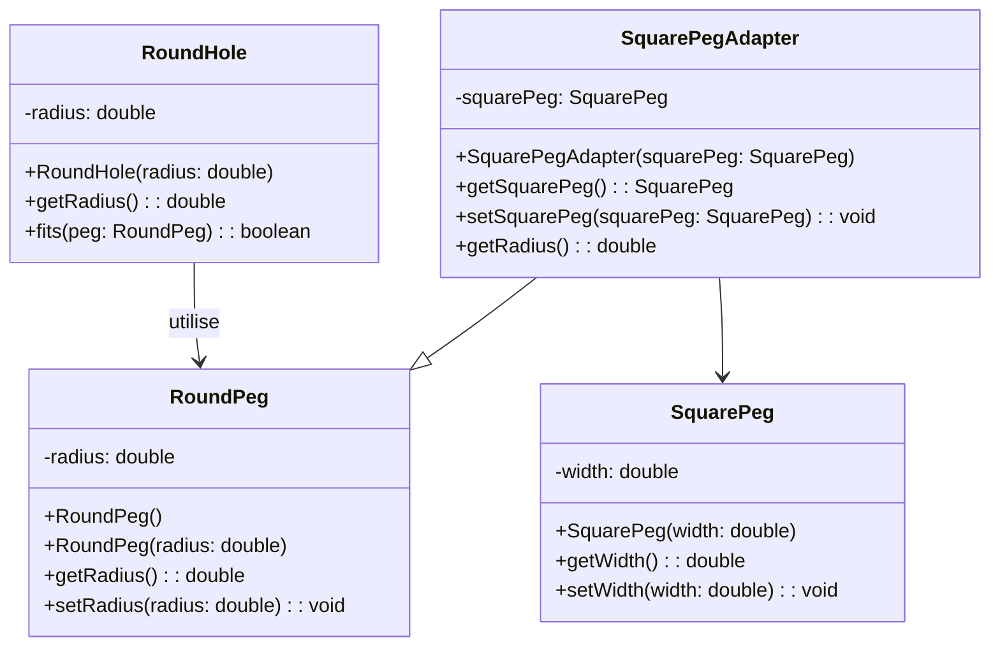

## Description
Adapter permet de faire collaborer des interfaces incompatibles en enveloppant (adapter) un objet existant pour qu’il expose l’interface attendue par le client.

## Quand l'utiliser ?
- Lorsque vous souhaitez réutiliser une classe existante dont l’interface ne correspond pas à celle requise.
- Quand vous voulez intégrer progressivement un composant tiers sans modifier son code.

## Avantages
- Favorise la réutilisation de composants existants.
- Isole les changements d’interface, limitant l’impact sur le reste du code.

## Inconvénients
- Multiplie parfois les couches d’indirection.
- Peut masquer des incompatibilités conceptuelles plus profondes.

## Exemple de code Java
```java
class RoundPeg {
    private double radius;

    public RoundPeg() {
        this.radius = 0.0;
    }

    public RoundPeg(double radius) {
        this.radius = radius;
    }

    public double getRadius() {
        return this.radius;
    }

    public void setRadius(double radius) {
        this.radius = radius;
    }
}

class RoundHole {
    private double radius;

    public RoundHole(double radius) {
        this.radius = radius;
    }

    public double getRadius() {
        return this.radius;
    }

    public boolean fits(RoundPeg peg) {
        if (peg == null) {
            return false;
        }
        return peg.getRadius() <= this.radius;
    }
}

class SquarePeg {
    private double width;

    public SquarePeg(double width) {
        this.width = width;
    }

    public double getWidth() {
        return this.width;
    }

    public void setWidth(double width) {
        this.width = width;
    }
}

class SquarePegAdapter extends RoundPeg {
    private SquarePeg squarePeg;

    public SquarePegAdapter(SquarePeg squarePeg) {
        this.squarePeg = squarePeg;
    }

    public SquarePeg getSquarePeg() {
        return this.squarePeg;
    }

    public void setSquarePeg(SquarePeg squarePeg) {
        this.squarePeg = squarePeg;
    }

    @Override
    public double getRadius() {
        if (this.squarePeg == null) {
            return 0.0;
        }
        // Rayon équivalent du carré inscrit dans un cercle
        return (this.squarePeg.getWidth() * Math.sqrt(2.0)) / 2.0;
    }
}

class Demo {
    public static void main(String[] args) {
        RoundHole hole = new RoundHole(5.0);
        RoundPeg roundPeg = new RoundPeg(5.0);
        SquarePeg squarePeg = new SquarePeg(7.0);
        SquarePegAdapter adapter = new SquarePegAdapter(squarePeg);

        System.out.println(hole.fits(roundPeg));
        System.out.println(hole.fits(adapter));
    }
}
```

## Diagramme de classes (Mermaid)


## Liens utiles
- https://refactoring.guru/design-patterns/adapter
- https://en.wikipedia.org/wiki/Adapter_pattern
