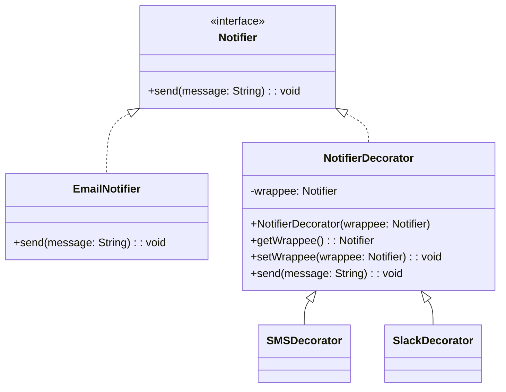

## Description
Decorator ajoute des responsabilités à un objet dynamiquement en l’enveloppant dans d’autres objets respectant la même interface.

## Quand l'utiliser ?
- Lorsque vous souhaitez ajouter des fonctionnalités à la volée sans modifier la classe d’origine.
- Pour éviter une explosion de sous-classes dédiées à chaque combinaison de comportements.

## Avantages
- Composition flexible des comportements.
- Respect du principe ouvert/fermé (ouvert à l’extension, fermé à la modification).

## Inconvénients
- Empilement de décorateurs qui peut rendre le débogage plus difficile.
- La configuration peut devenir verbeuse.

## Exemple de code Java
```java
interface Notifier {
    void send(String message);
}

class EmailNotifier implements Notifier {
    @Override
    public void send(String message) {
        System.out.println("Email: " + message);
    }
}

abstract class NotifierDecorator implements Notifier {
    private Notifier wrappee;

    public NotifierDecorator(Notifier wrappee) {
        this.wrappee = wrappee;
    }

    public Notifier getWrappee() {
        return this.wrappee;
    }

    public void setWrappee(Notifier wrappee) {
        this.wrappee = wrappee;
    }
}

class SMSDecorator extends NotifierDecorator {
    public SMSDecorator(Notifier wrappee) {
        super(wrappee);
    }

    @Override
    public void send(String message) {
        if (getWrappee() != null) {
            getWrappee().send(message);
        }
        System.out.println("SMS: " + message);
    }
}

class SlackDecorator extends NotifierDecorator {
    public SlackDecorator(Notifier wrappee) {
        super(wrappee);
    }

    @Override
    public void send(String message) {
        if (getWrappee() != null) {
            getWrappee().send(message);
        }
        System.out.println("Slack: " + message);
    }
}

class Demo {
    public static void main(String[] args) {
        Notifier notifier = new EmailNotifier();
        notifier = new SMSDecorator(notifier);
        notifier = new SlackDecorator(notifier);
        notifier.send("Bienvenue !");
    }
}
```

## Diagramme de classes (Mermaid)


## Liens utiles
- https://refactoring.guru/design-patterns/decorator
- https://en.wikipedia.org/wiki/Decorator_pattern
