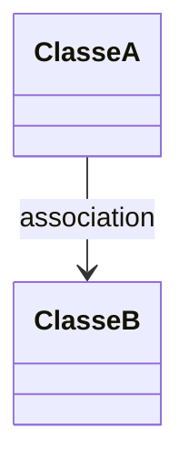
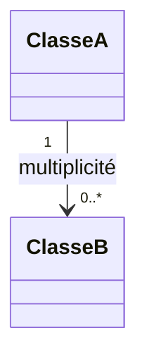
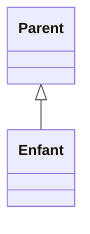
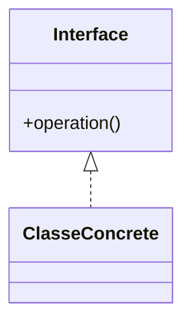
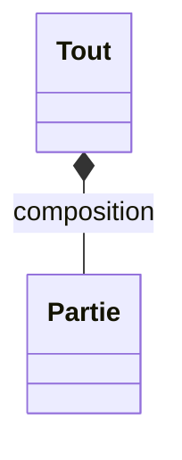
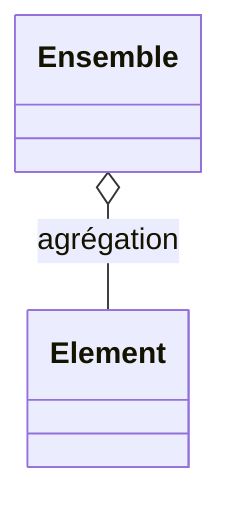
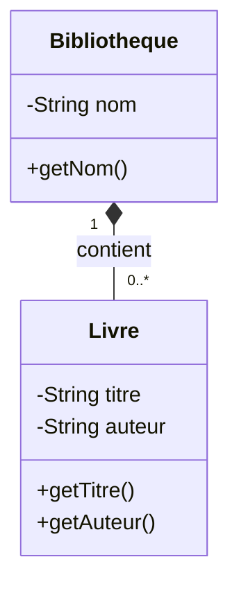
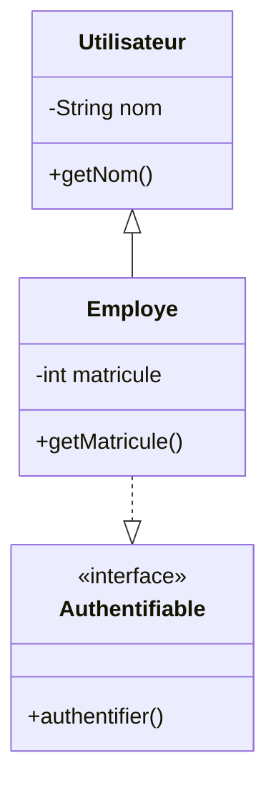
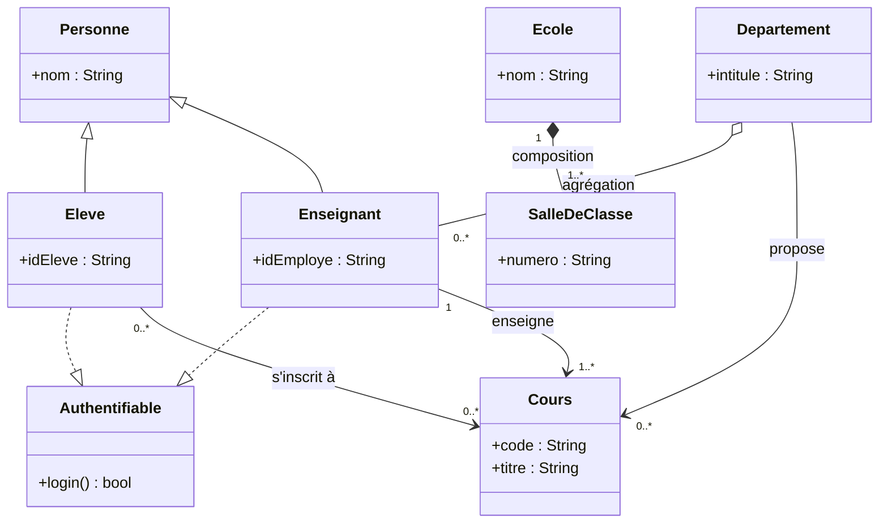

# Diagrammes de classes UML

Le **diagramme de classes** montre les **classes**, leurs **attributs**, leurs **méthodes**, ainsi que les **relations** entre elles. C’est le diagramme structurel le plus utilisé en conception orientée objet.

> Références : OMG — UML 2.5.1 (diagram semantics), GeeksforGeeks — UML Diagrams

## Objectifs d’un diagramme de classes
- Décrire la **structure** statique du système (types — pas instances)
- Visualiser **associations**, **dépendances**, **héritages**, **implémentations**, **agrégations** et **compositions**
- Servir de base à la conception orientée objet et à la documentation de l’architecture

## Principaux symboles et concepts

### Classe
Représentée par un rectangle à trois sections: *nom*, *attributs*, *méthodes*.

### Visibilité

| Symbole | Visibilité | Description |
|---------|------------| ------------------------------------|
| +       | public     | Champ à visibilité publique (`public` en Java)|
| #       | protégé    | Champ à visibilité protégée (`protected` en Java)|
| ~       | package    | Champ à visibilité limitée aux entités faisant partie du même *package* ou *namespace* (représenté par l'absence de mot-clé en Java)
| -       | privé      | Champ à visibilité privée (`private` en Java)|

### Relations entre classes

**1. Association (forte)**
Une association représente un lien logique durable entre deux classes. Elle est représentée par une flèche simple qui pointe vers la classe associée.

**2. Multiplicités**
La cardinalités entre les classes est identifiée par un nombre à chaque extrémité du lien qui illustre la relation. On peut ainsi représenter les relations 1:1, 1:N, N:1, N:M

| Multiplicité | Signification |
|--------------|---------------|
| 0..1         | Aucun ou un seul élément (optionnel) |
| 1            | Exactement un élément |
| 0..*         | Zéro, un ou plusieurs éléments |
| 1..*         | Un ou plusieurs éléments |
| n            | Exactement *n* éléments (ex. 3) |
| 0..n         | De zéro à *n* éléments |
| 1..n         | D’un à *n* éléments |
| *            | Nombre indéterminé (équivalent à 0..*) |
| n..m         | Entre *n* et *m* éléments inclus |

**3. Héritage**
L'héritage "classique" où une classe enfant hérite des caractéristiques de la classe de base est représentée par une flèche pleine creuse qui pointe vers la classe de base.

**4. Implémentation**
L'implémentation d'une interface, qu'il soit implicite ou explicite, est représentée par une flèche pointillée creuse qui pointe vers l'interface.

**5. Composition**
La composition représente une relation forte, c'est-à-dire une relation où un tout est composé de ses éléments et où les éléments ne peuvent pas exister sans le tout. En UML, on représente cette relation par une flèche avec un bout en forme de lozange plein qui pointe vers le tout.

**6. Agrégation**
L'agrégation est similaire à la composition, mais elle représente une relation faible, c'est-à-dire que les éléments peuvent exister indépendamment. En UML, on représente cette relation par une flèche avec un bout en forme de lozange vide qui pointe vers le tout.

## Quand l'utiliser ?
- Décomposer un domaine en concepts  
- Clarifier les relations essentielles (composition, héritage, interfaces)  
- Préparer une architecture orientée objet  
- Documenter les structures logiques (modèle de domaine)

## Exemple simple

## Exemple avec héritage et implémentation

## Exemple complet

## Liens utiles
- [https://en.wikipedia.org/wiki/Class_diagram](https://en.wikipedia.org/wiki/Class_diagram)
