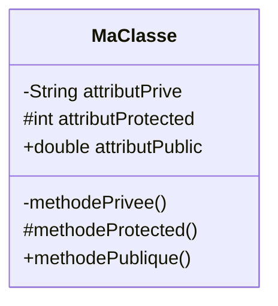
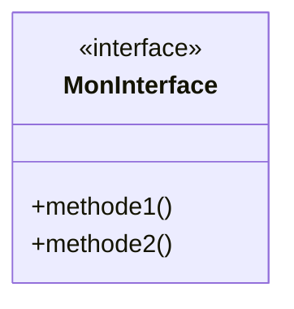
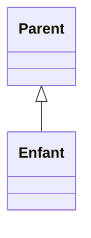
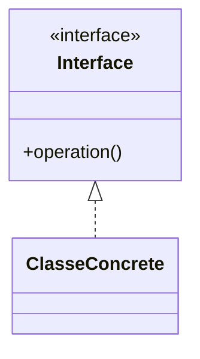
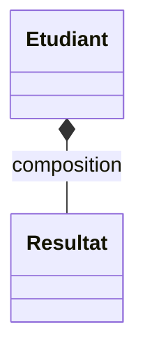
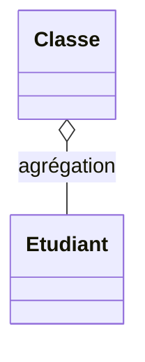
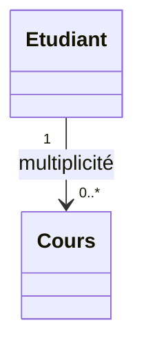
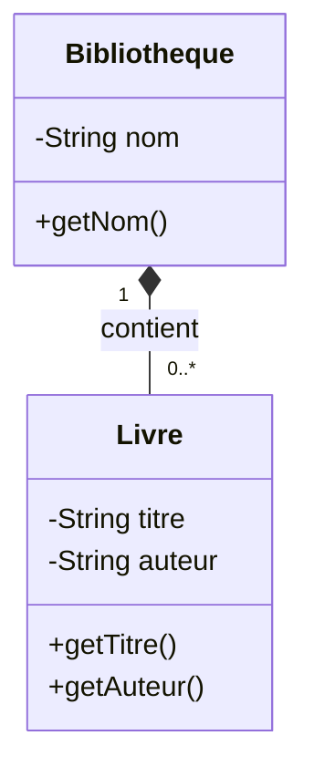
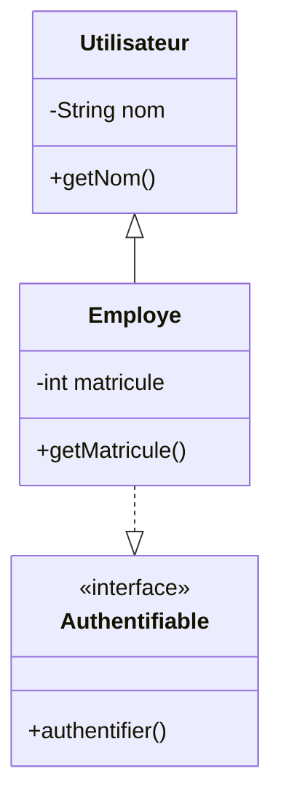
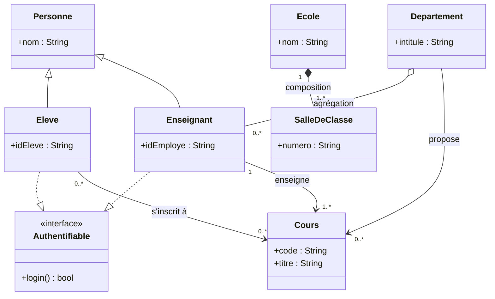

# Diagrammes de classes UML

Le **diagramme de classes** montre les **classes**, leurs **attributs**, leurs **méthodes**, ainsi que les **relations** entre elles. C’est le diagramme structurel le plus utilisé en conception orientée objet.

## Objectifs d’un diagramme de classes
- Décrire la **structure** statique du système (types — pas instances)
- Visualiser **associations**, **dépendances**, **héritages**, **implémentations**, **agrégations** et **compositions**
- Servir de base à la conception orientée objet et à la documentation de l’architecture

## Quand l'utiliser ?
- Décomposer un domaine en concepts  
- Clarifier les relations essentielles (composition, héritage, interfaces)  
- Préparer une architecture orientée objet  
- Documenter les structures logiques (modèle de domaine)

## Représentation d'une classe

Une classe est représentée par un rectangle à trois sections: *nom*, *attributs*, *méthodes*.

Il s'agit ici d'une classe au sens large; on utilise aussi cet élément pour représenter les interfaces, les records, et autres variations spéciales selon le langage. Il est possible de préciser le type de classe précis (appelé le *Stereotype*) en utilisant le symbole `<< >>`, par exemple :

Chaque attribut ou méthode est précédé d'un symbole représentant sa visibilité :

| Symbole | Visibilité | Description |
|---------|------------| ------------------------------------|
| `+`       | public     | Champ à visibilité publique (`public` en Java)|
| `#`       | protégé    | Champ à visibilité protégée (`protected` en Java)|
| `~`       | package    | Champ à visibilité limitée aux entités faisant partie du même *package* ou *namespace* (représenté par l'absence de mot-clé en Java)|
| `-`       | privé      | Champ à visibilité privée (`private` en Java)|

## Relations entre classes

### Association

Une association représente un lien logique entre deux classes, indiquant qu'elles sont liées d'une certaine manière. Il existe deux types d'association :
- Association simple : C'est le cas le plus courant, où les deux classes *se connaissent* mutuellement. En d'autres termes, la relation implique que les deux classes ont une assiociation bidirectionnelle. Dans ce cas, on utilise un trait sans flèche entre les deux classes.
- Association directionnelle : Plus rarement, on voudra indiquer la direction de l'association (A connaît B, mais B ne connaît pas A). Dans ce cas, on utilisera une flèche simple pointant dans le sens de l'association.

### Héritage

L'héritage "classique" où une classe enfant hérite des caractéristiques de la classe de base est représentée par une flèche pleine creuse qui pointe vers la classe de base.

**Exemple**

### Implémentation

L'implémentation d'une interface, qu'elle soit implicite ou explicite, est représentée par une flèche pointillée creuse qui pointe vers l'interface.

**Exemple**

### Composition

La composition représente une relation forte, c'est-à-dire une relation où un tout est composé de ses éléments et où les éléments ne peuvent pas exister sans le tout. En UML, on représente cette relation par une flèche avec un bout en forme de lozange plein qui pointe vers le tout.

**Exemple**

*Dans cet exemple, le profil d'un étudiant est composé (entre autres) de ses résultats. Les résultats ne peuvent pas exister sans l'étudiant.*

### Agrégation

L'agrégation est similaire à la composition, mais elle représente une relation faible, c'est-à-dire que les éléments peuvent exister indépendamment. En UML, on représente cette relation par une flèche avec un bout en forme de lozange vide qui pointe vers le tout.

**Exemple**

*Dans cet exemple, une classe est l'agrégation d'un certain nombre d'étudiants. Les étudiants peuvent exister sans être dans une salle de classe.*

## Cardinalité (multiplicité)

Certaines relations, principalement les associations, les compositions et les agrégations, peuvent impliquer des relations 1:1, 1:N ou même N:M. On représente ces contraintes par deux nombres sur le lien entre les deux classes (un nombre pour la source et l'autre pour la destination).

| Multiplicité | Signification |
|--------------|---------------|
| 0..1         | Aucun ou un seul élément (optionnel) |
| 1            | Exactement un élément |
| 0..*         | Zéro, un ou plusieurs éléments |
| 1..*         | Un ou plusieurs éléments |
| n            | Exactement *n* éléments (ex. 3) |
| 0..n         | De zéro à *n* éléments |
| 1..n         | D’un à *n* éléments |
| *            | Nombre indéterminé (équivalent à 0..*) |
| n..m         | Entre *n* et *m* éléments inclus |

**Exemple**

*Dans cet exemple, un étudiant peut suivre entre 0 et plusieurs cours.*

## Exemples

**Classes, attributs, méthodes**

**Héritage - Classes concrètes et interfaces**

**Modèle complet**

## Liens utiles
- [https://en.wikipedia.org/wiki/Class_diagram](https://en.wikipedia.org/wiki/Class_diagram)
