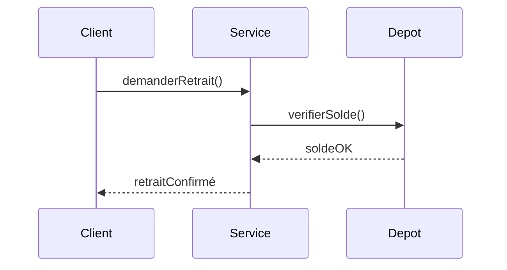
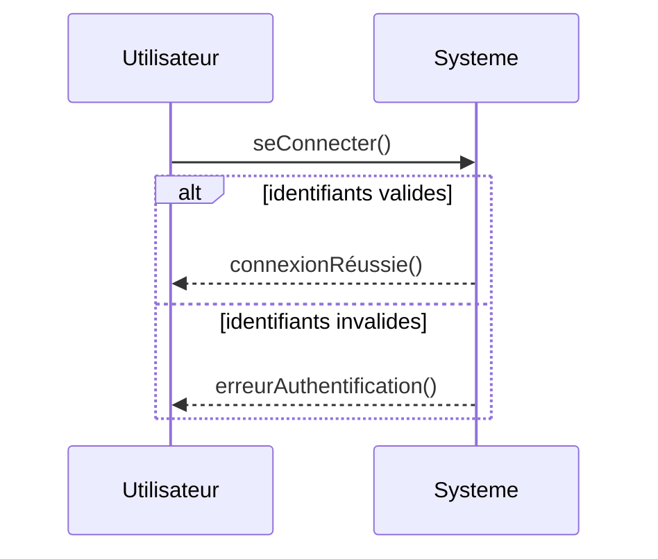
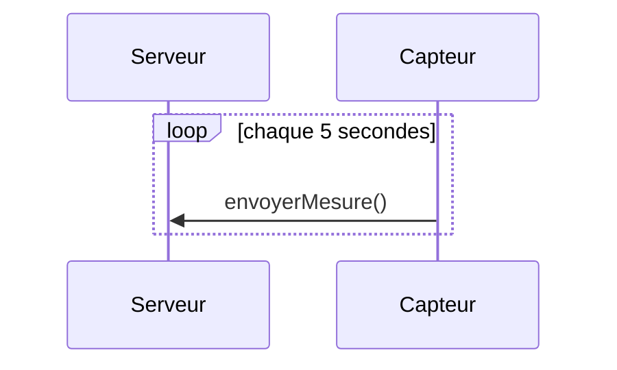

# Diagrammes de séquence UML

Les **diagrammes de séquence** modélisent les **interactions temporelles** entre des objets ou acteurs : ils montrent l’ordre des messages dans un scénario précis. Ils appartiennent aux diagrammes comportementaux axés sur l’interaction.

> Références : OMG — UML 2.5.1, Wikipédia — Unified Modeling Language (sequence diagrams)

## Objectifs
- Visualiser **comment** les objets collaborent dans une situation donnée
- Décrire le **flux temporel** d’un scénario (du premier au dernier message)
- Aider à valider un cas d’utilisation et à repérer le couplage

## Principaux symboles et concepts

### Ligne de vie (*lifeline*)
Participant à l’interaction (acteur ou objet).

### Barre d’activation
Montre qu’un participant exécute une opération.

### Messages
- **Synchrone** : flèche pleine  
- **Asynchrone** : flèche ouverte  
- **Retour** : flèche en pointillés

### Fragments combinés
- `alt` (alternatives)  
- `opt` (optionnel)  
- `loop` (répétition)  
- `par` (parallélisme)

> Références : OMG — About UML 2.5.1 (interactions), Wikipédia — Unified Modeling Language

## Quand utiliser un diagramme de séquence ?
- Décrire un **cas d’utilisation** pas à pas  
- Visualiser un **scénario métier**  
- Expliquer une interaction complexe (transactions, appels distribués)  
- Clarifier les responsabilités entre objets

## Exemple simple en Mermaid

## Exemple avec `alt`

## Exemple avec `loop`

