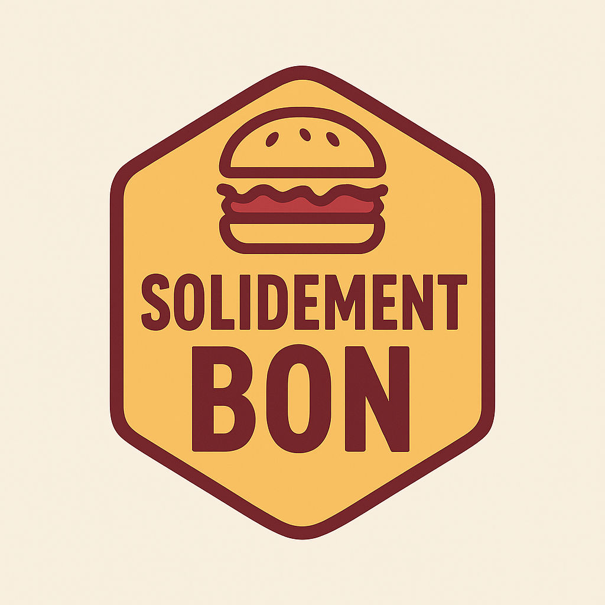

# Projet : Amélioration d'une applications de gestion des commandes d'un *food truck*

## Mise en situation



Ça y est! Après des mois de travail acharné pour raffiner son modèle d'affaires, votre cousin est finalement prêt à lancer SOLIDEMENT Bon, un *food truck* qui se promènera partout au Québec au gré des différents événements et festivals. Pendant qu'il se concentrait sur le lancement de son entreprise, il a confié le développement de l'application de gestion de commandes et de paiement à une firme externe. Ne disposant pas de beaucoup de moyens au départ, il a donné le contrat à la firme qui offrait le plus bas prix, même si elle semblait un peu louche. 

À quelques semaines du début de ses opérations, votre cousin désire ajouter quelques éléments à son menu, ainsi qu'ajouter de nouveaux types de paiement et moyens de notifications. À sa grande surprise, la firme ayant conçu l'application lui répond que ces modifications, qui sont pourtant simples, lui coûteront presque autant que le développement initial et prendront plusieurs mois. Désespéré, il se souvient alors que vous suivez des cours en développement de logiciels au Collège de Maisonneuve, et il vous supplie de l'aider.

## Objectifs pédagogiques

- Comprendre les **principes SOLID** et les impacts négatifs liés à leur non-respect.
- Améliorer la maintenabilité d'une application par la **refactorisation** et/ou l'utilisation de **patrons de conception**
- Ajouter les nouvelles fonctionnalités **sans impact majeur au code refactorisé** (***open-closed principle***)
- Produire un **diagramme UML de classes** et un plan de tests.

## Tâches à réaliser

1. **Analyse SOLID**
  - Identification des violations aux principes SOLID présentes dans l'application initiale
  - Explication du principe non respecté

1. **Amélioration du code**
  - Pour chaque principe SOLID non respecté, fournir une nouvelle implémentation qui corrige le problème.
  - Pour chaque correctif, expliquez comment votre nouvelle implémentation corrige le problème soit directement en commentaire dans le code, ou dans la partie **Analyse SOLID** ci-haut.
  - *Au moins l'une des corrections devra utiliser un patron de conception étudié en classe*

1. **Ajout des nouvelles fonctionnalités**
  - Afin de valider que les changements effectués améliorent la maintenabilité de l'application, ajouter les fonctionnalités suivantes :
    - Ajout du **nouveau plat** `SALADE` avec les options suivantes :
      - `taille` : valeurs possibles `petite`, `grande`
      - `vinaigrette` : valeurs possibles `cesar`, `maison`
      - *Portez une attention particulière à la façon dont ces options peuvent s'intégrer avec les options `epice` (épicé) et `extraFromage` qui sont déjà présentes pour les plats existants.*
    - Ajout du **nouveau mode de paiement** `VIREMENT`, qui permettra aux clients de payer par virement bancaire.
    - Ajout du **nouveau type de notification** `SMS`, qui permettra d'informer le client de l'état de sa commande par messagerie texte.

1. **Amélioration du système de notification**
  - L'application doit informer le client de l'état de sa commande à deux moments : 
    - Lorsque la commande est passée (comme c'est le cas actuellement)
    - Lorsque la commande est prête (à ajouter)
  - ***Indice** : L'un des patrons de conception étudiés dans le cours est particulièrement bien adapté pour ce type de fonctionnalité...*

1. **Ajustement de la classe de démarrage `App`**
  - La classe doit être ajustée pour :
    - Profiter des améliorations que vous avez faites dans le code
    - Permettre l'utilisation des fonctionnalités ajoutées


1. **Diagramme UML de classes** pour la partie refactorée.
  - Ce diagramme peut être réalisé à l'aide d'un logiciel, ou fait à la main puis remis sous forme d'image (à condition qu'il soit lisible)

1. **Plan de tests** pour valider le comportement.
  - Il peut s'agir d'un plan de tests manuels ou de tests automatisés à l'aide d'une librairie de tests comme **j-unit**


## Évaluation

| Critère                                  | Points |
| -----------------------------------------| -------- |
| Analyse SOLID                            | 5      |
| Amélioration du code                     | 5      |
| Ajout des nouvelles fonctionnalités      | 5      |
| Amélioration du système de notification  | 2      |
| Ajustement de la classe `App`            | 2      |
| Diagramme UML                            | 3      |
| Plan de tests                            | 3      |
| **Total**                                | **25** |

---

## À remettre

- Un fichier **.zip** de votre projet, comprenant:
  - Tout le projet Java (code de votre solution, fichier pom.xml, etc).
  - L'analyse SOLID (dans le fichier `README.md` ou un document Word ou PDF dans le sous-répertoire `docs`)
  - Le diagramme de classes UML (fichier JPG, PNG ou PDF exporté d'un logiciel ou photo si fait à la main)
  - Le plan de tests (directement dans le code si automatisé, ou dans le fichier `README.md` ou un document Word ou PDF dans le sous-réperoire `docs`)
- Le travail est à remettre sur Léa (Omnivox) dans la section "Travaux - Énoncés et remises"
- Le travail peut être fait en équipes de **deux** ou **trois** personnes (une seule remise pour l'équipe)
- Le travail est à remettre au plus tard le **24 février 2026 en fin de journée**.
- Le projet doit pouvoir être exécuté de la façon suivante:

```bash
mvn clean package
java -jar <nom du fichier>.jar
```