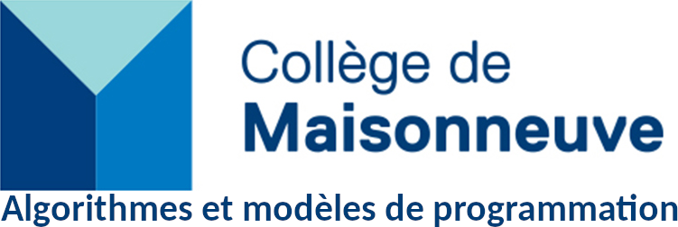

Bienvenue sur le site du cours Algorithmes et modèles de programmation (420-930-MA) du Collège de Maisonneuve. Vous trouverez sur ce site tout le matériel du cours, incluant les notes de cours, le calendrier et le code des différents projets.

Quelques liens importants:

* [Omnivox/Léa](https://cmaisonneuve-lea.omnivox.ca/)
* [Moodle](https://moodle.cmaisonneuve.qc.ca/course/view.php?id=7676https:/)
* [GitHub](https://github.com/ophenix-420-930-ma-24636)
